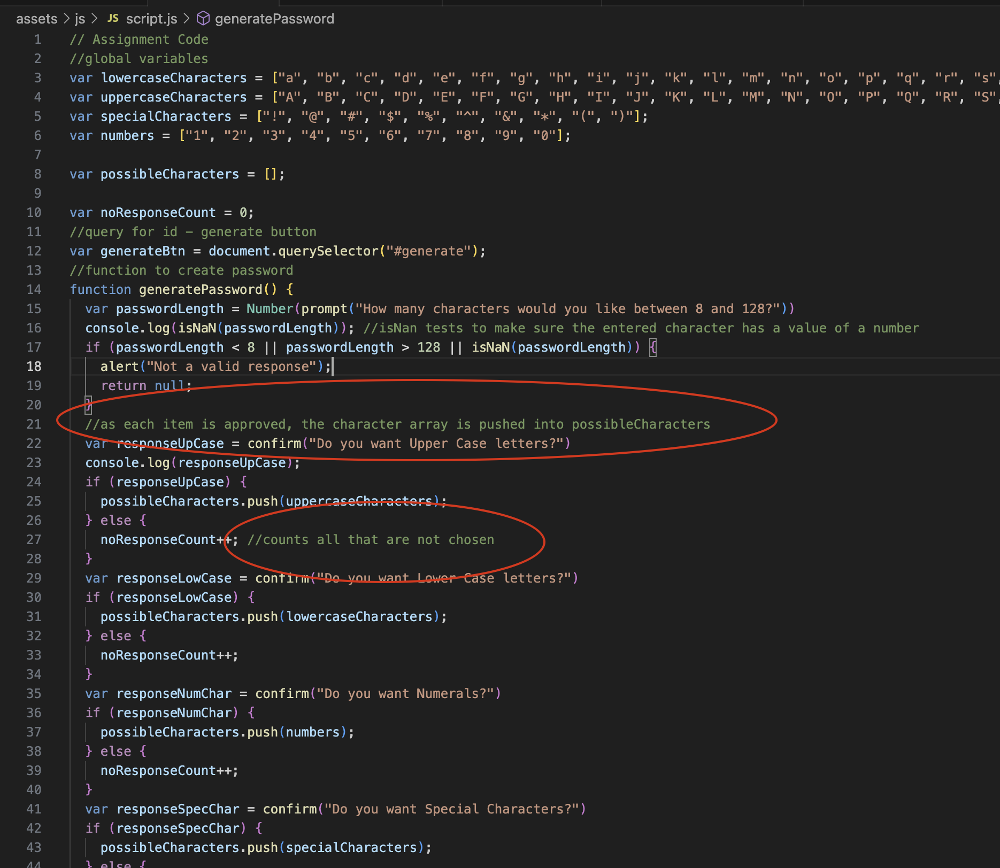
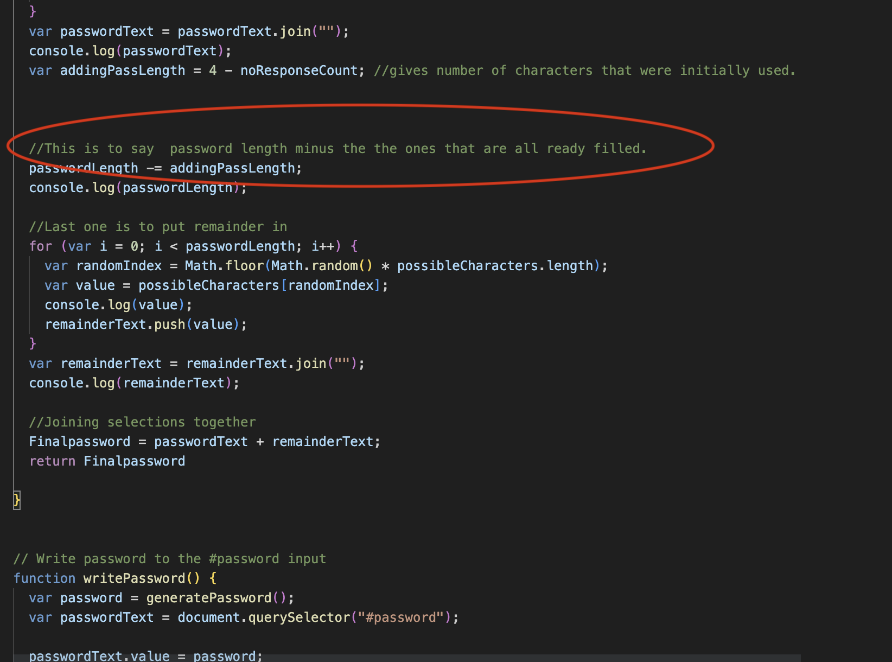
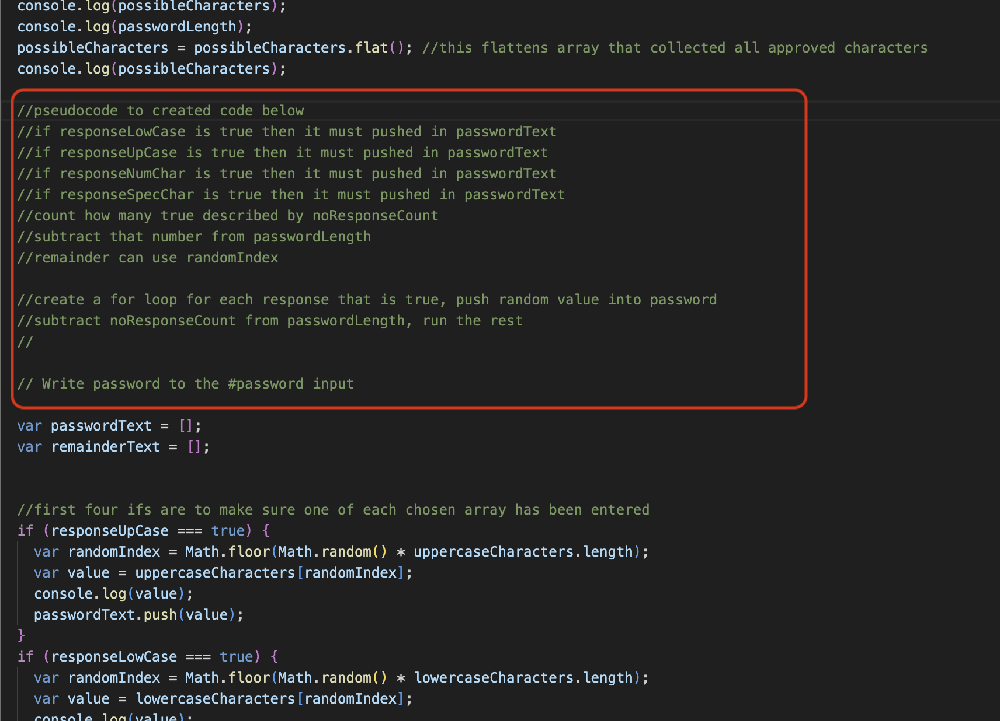
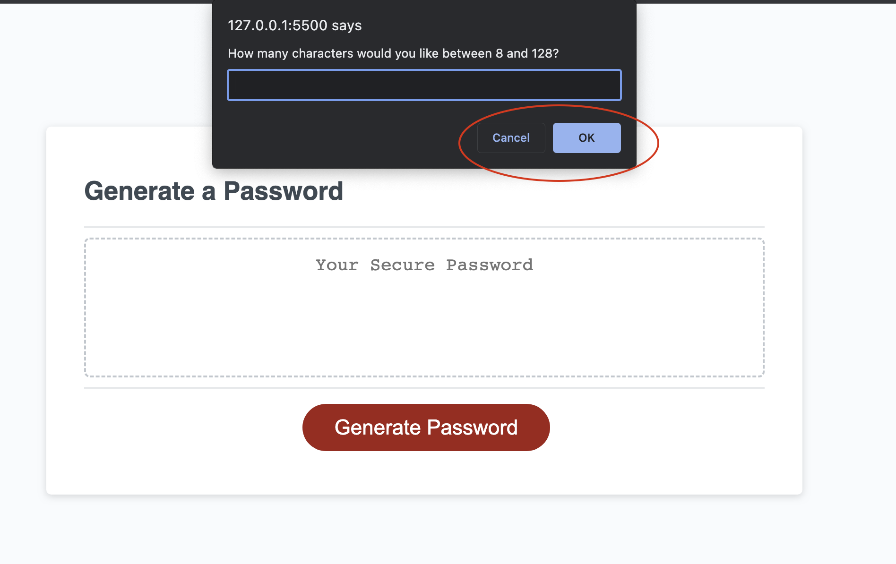
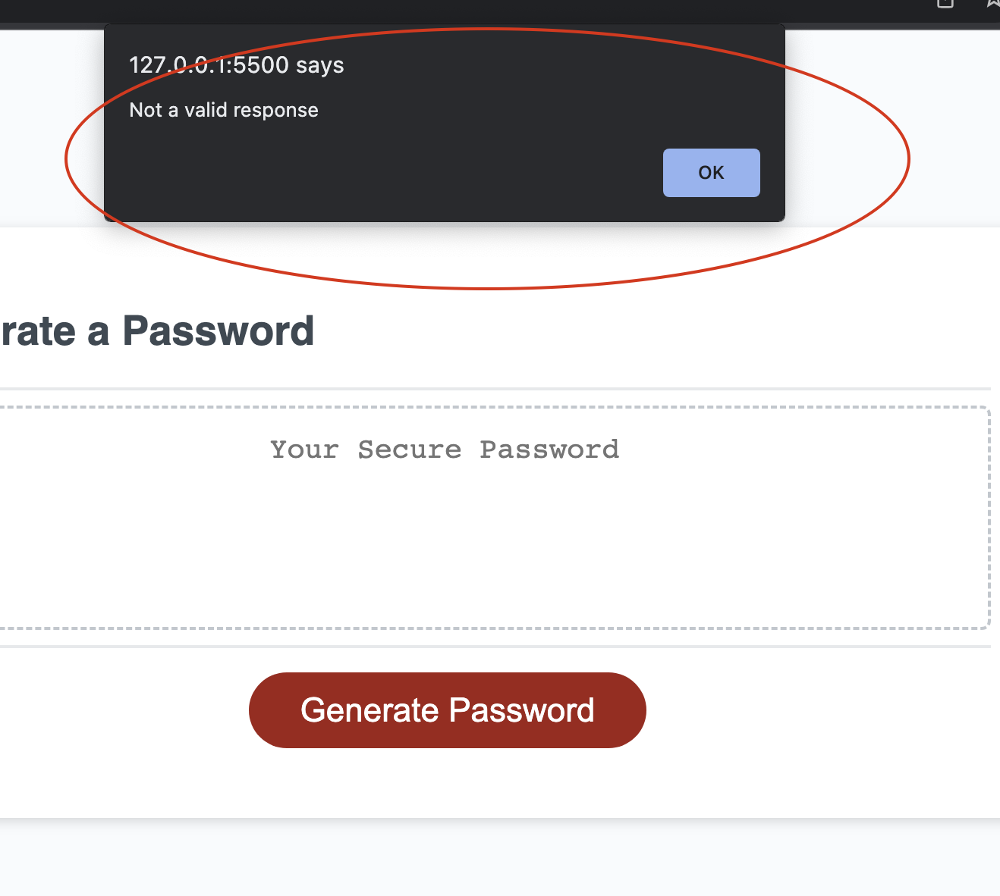
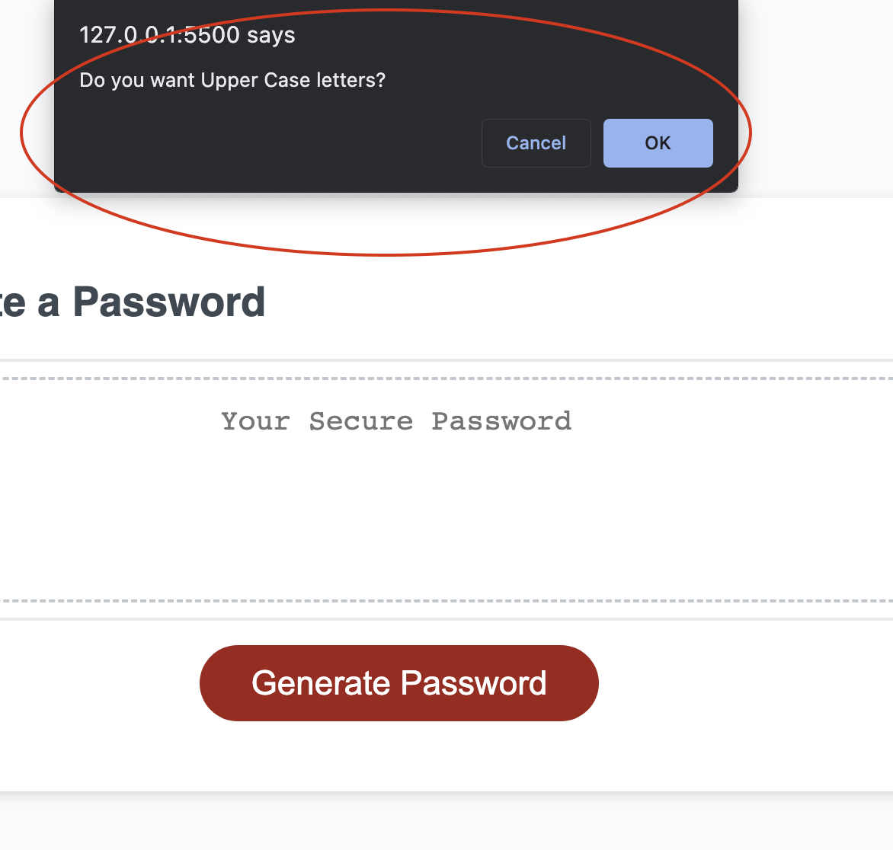
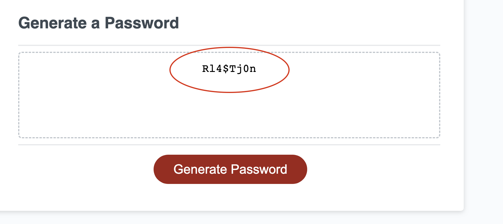

# <Pam_Willis_My-Password-Generator>

## Creating a random password and validating to assure that it meets specifications entered

The password was created using a listener event for the button triggering the function to proceed to create a password

- Each confirm requests the user to enter information needed to create password, then it is run through a series of pushing into an array and eventually flattening to create a pool of characters to choose from. Then the first characters are randomly chosen to make sure one of each initial array is included. In this process an isNan is added to make sure the password length value is a number, it is also checked to make sure it is in the range requested. Finally the remainder characters are randomly filled. Then it is linked into the id(password) in the html file.
- Using pseudo code I have learned how to think the process through before writing the code. In the process I can break down what code will be needed, and in what order.
- In writing the code, I went beyond the requirements and have guaranteed that at least one character from each chosen array will definately be in the password.
- During this projects I have begun to understand javascript in how to write an if statement, function, use Math code to pull random characters, and also to use console.log along the way in order to test and make sure I am getting the result I expect.

Within javascript it has been noted along the way of the full thought process in order to allow other coders to understand the process.

--This shows my pseudo code thought process for this section.

## Usage

The following show how the file is used.
When hitting the generate password, prompts will appear asking the user for how long a password should be.

--The first prompt will asking how many characters are required in password.

--If a letter is entered this will appear and user will have to start over.

--Then user will click OK if you want requested characters or cancel if you do not, this continues until all  possible characters have been reviewed.

--A password is generated including chosen characters.

## Website and GitHub address

Deployment website address: https://pamwillis.github.io/Pam_Willis_My-Password-Generator/

GitHub:
https://github.com/PamWillis/Pam_Willis_My-Password-Generator.git
